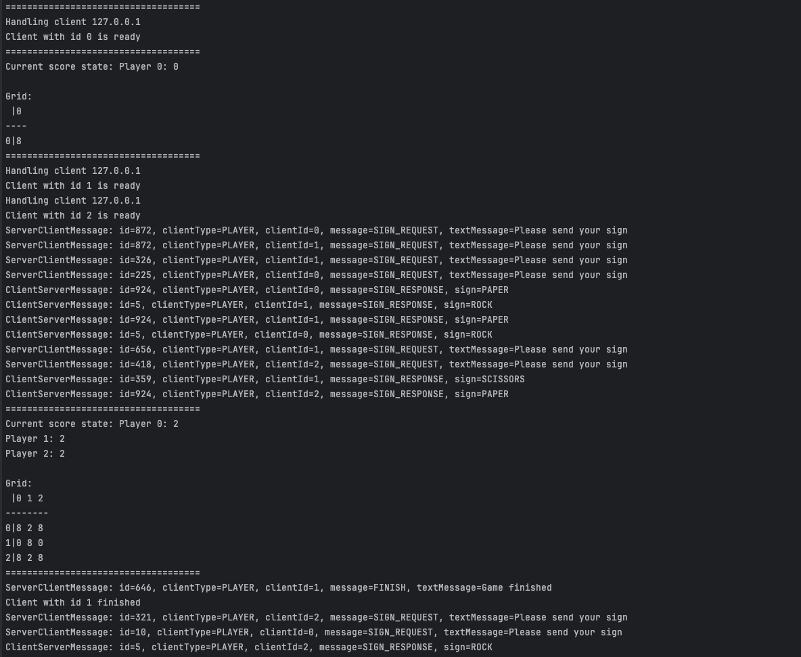
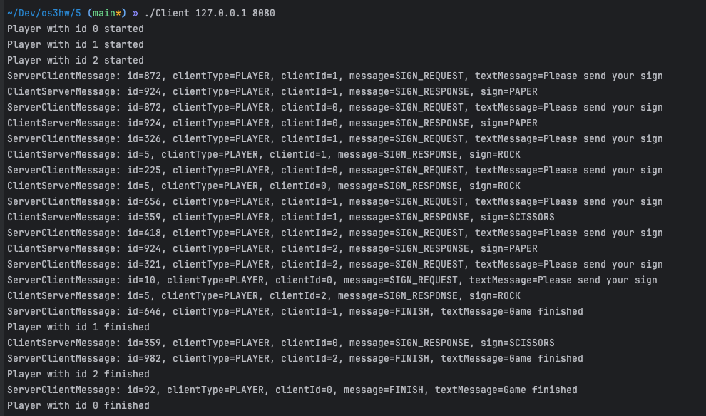
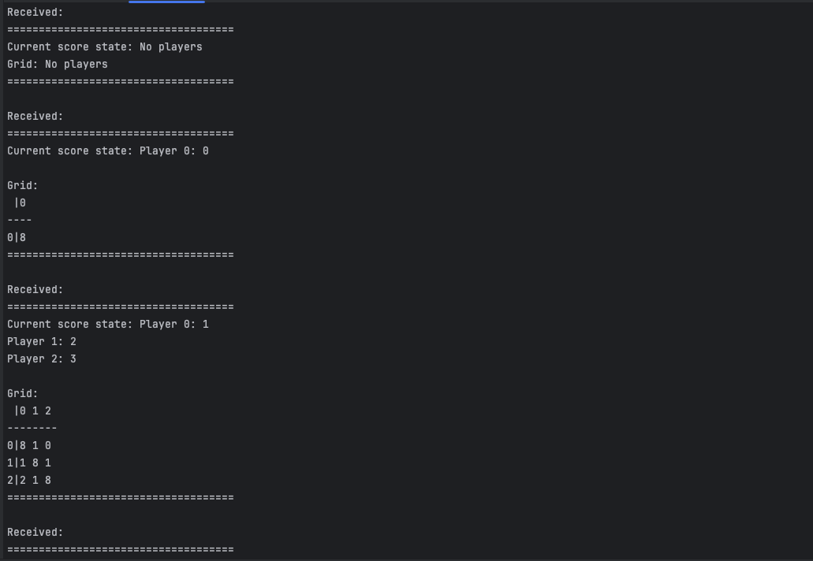

# Отчет
_Китаев Никита Алексеевич_
_БПИ223_

**Вариант 35.**
«Камень, ножницы, бумага» 1 — однокруговая система.
N cтудентов, изнывающих от скуки на лекции по операционным
системам решили организовать однокруговой турнир в игру «Камень, ножницы, бумага». Каждый с каждым при этом играет только один раз. За победу дается два очка, за ничью — одно, за поражение — ноль.
Требуется создать клиент–серверное приложение, моделирующее турнир.
Каждый студент — отдельный клиент. Генерация камня, ножниц и бумаги в каждом поединке формируется сервером случайно. Завершение работы программ осуществляется по завершению турнира. Количество участвующих студентов задается сервером.

Работа выполнена на оценку 7

## Краткое описание
Клиент–серверное приложение, в котором сервер (или серверы) и клиенты независимо друг от друга отображают только ту информацию, которая поступает им во время обмена.
### Компиляция
* Сервер
```
gcc Server.c DieWithError.c PrintMessage.c HandleClient.c AcceptConnection.c CreateServerSocket.c -o Server
```
* Клиенты
```
gcc Client.c DieWithError.c PrintMessage.c -o Client 
```
или
* Сервер
```
bash ./CompileServer.sh
```
* Клиенты
```
bash ./CompileClient.sh
```
 
### Запуск
* Сервер
```
./Server <port>
```
* Клиенты
```
./Client <ip> <port>
```
*Была разбработана дополнительная функция в Client.c, которая создаёт клиенты для **автоматизации тестирования**. Так как по условию клиент не знает, сколько всего может быть клиентов, он создаёт их бесконечно много. Если сервер переполнен клиентами, он отказывает в подключении, высылая ответное сообщение клиенту с текстом ошибки.*.

### Реализация на оценку 4-5
#### Сценарий
Изначально формируется N клиентов на сервере. После того, как сервер заполнился, все начинают поочерёдно играть со всеми. Для хранения игрока в разделяемой памяти была использована следующая структура:
```
typedef struct {
    int id;
    int fd;
    int score;
    bool isReady;
} Player;
```
#### Завершение
* Клиент завершается автоматически при окончании игры
* Сервер завершается сочетанием ```^C```
#### Результаты работы программы
* Server

* Clients


### Реализация на оценку 6-7
#### Компиляция
* Сервер
```
gcc Server.c DieWithError.c PrintMessage.c SendMessage.c HandleClient.c AcceptConnection.c CreateServerSocket.c -o Server  
```
* Клиенты
```
gcc Client.c DieWithError.c PrintMessage.c SendMessage.c -o Client
```
* Наблюдатель
```
gcc Viewer.c DieWithError.c PrintMessage.c SendMessage.c -o Viewer
```
или
* Сервер
```
bash ./CompileServer.sh
```
* Клиенты
```
bash ./CompileClient.sh
```
* Наблюдатель
```
bash ./CompileViewer.sh
```
#### Запуск
```
./Viewer <ip> <port>
```
#### Сценарий

В дополнение к предыдущей задаче был разработан модуль для извлечения логов с сервера (Viewer).

Для визуализации логов была написана карта.

Описание клеток поля:
```
grid[i][j] = 8 – игроки i и j ещё не играли.
grid[i][j] = 2 – победил i.
grid[i][j] = 1 – ничья.
grid[i][j] = 0 – победил j.
```
#### Результаты работы программы
* Viewer
